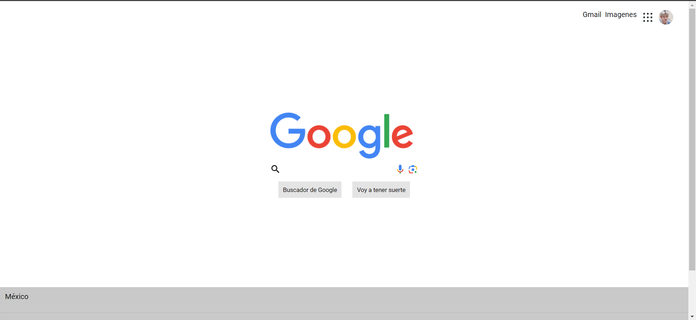

# Clon de Google: Tecnolochicas PRO 

Este proyecto fue creado durante el bootcamp Tecnolochicas PRO, es clon de google, principalmente su estructrua. 

El proposioto de la creación de este clon de google se el practicar y desarrolar habiliades en el manejo de HTML y CSS

## Índice 
 1. Intro
 2. Secciones
 3. ¿Qué construímos? 
 4. Objetivos del aprendizaje 

## Intro 
En este proyecto nos centramos en la realización más que nada a manera de práctica de un "clon de Google" esto con la finalidad de comprender mejor elementos de CSS y HTML.  

### Secciones (Captura de pantalla)

### Tecnologias 
 - CSS
 - HTML
 - JS 

## ¿Que construimos?
Con aún página principalmente de HTML y CSS, basándonos en la estructura de la página de buscador de Google, tomamos como base ciertos aspectos y con ello construimos una versión similar a dicha página, al ser uno de los primeros proyectos desarrollados, hay ciertas funciones o detalles que aún hay por corregir. 

## Objetivos de aprendizaje
Obtener un manejo entre basico a medio de las tecnologias utilizadas. 

## Contacto 
Si estas interesado en compartir o concectar para algun proyecto u oportunidad laborar, contactame. 

